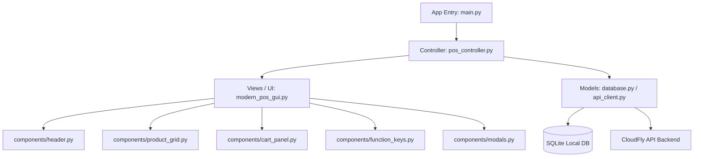

# 📋 Documento de Spec-Driven Development (SDD) - CloudFly POS Python Desktop

Este documento define la especificación técnica y de diseño para la implementación de la aplicación de escritorio **CloudFly POS Python**, utilizando **Python 3**, **Tkinter** y **TTK (Themed Tkinter)** con estilos modernos, planos y responsivos.

---

## 1. 🎯 Visión General e Identidad Visual

El objetivo es desarrollar un punto de venta (POS) de escritorio ligero, rápido y estéticamente sorprendente, que sirva tanto para la venta de **productos físicos** (con control de inventario) como de **servicios** (con duración y asignación).

### 🎨 Sistema de Diseño (Estilos TTK Modernos)
Para romper con la estética "retro" por defecto de Tkinter, utilizaremos un sistema de diseño plano y profesional (Sleek Dark Mode por defecto, con opción a Elegant Light Mode) configurando el motor de estilos de **TTK (`ttk.Style`)** y dibujando elementos interactivos avanzados.

#### Paleta de Colores (Estilo Dark/Slate Premium)
| Elemento | Color Hex | Uso en UI |
| :--- | :--- | :--- |
| **Primary (Brand)** | `#6366f1` (Indigo) | Elementos clave, botones de acción principal, acentos. |
| **Success** | `#10b981` (Emerald) | Botón de cobro, estado activo, indicadores positivos. |
| **Warning/Alert** | `#f59e0b` (Amber) | Advertencias de stock bajo, reembolsos. |
| **Danger** | `#ef4444` (Rose) | Cancelar, borrar, salir, alertas críticas. |
| **Bg Main** | `#0f172a` (Slate 900) | Fondo principal de la ventana. |
| **Bg Card** | `#1e293b` (Slate 800) | Contenedores de tarjetas, secciones, carrito. |
| **Bg Border** | `#334155` (Slate 700) | Bordes de inputs, separadores finos. |
| **Text Primary** | `#f8fafc` (Slate 50) | Títulos, texto principal, montos. |
| **Text Secondary**| `#94a3b8` (Slate 400) | Subtítulos, descripciones secundarias. |

#### Tipografía y Elementos Visuales
*   **Tipografía:** Utilizaremos `Segoe UI` (Windows), `San Francisco` (macOS) o `Helvetica/Arial` como fallback, configurando tamaños jerárquicos:
    *   *Total Prominente:* `font=("Segoe UI", 36, "bold")`
    *   *Títulos de Sección:* `font=("Segoe UI", 16, "bold")`
    *   *Texto Normal / Botones:* `font=("Segoe UI", 11, "normal")`
    *   *Datos del Carrito:* `font=("Segoe UI", 10, "normal")`
*   **Bordes y Sombras:** Aunque TTK no soporta sombras complejas de manera nativa, simularemos relieves modernos usando sub-bordes oscuros y frames anidados con un pixel de diferencia, junto con hover effects dinámicos en los botones.
*   **Micro-animaciones:** Implementaremos eventos `<Enter>` y `<Leave>` en los componentes TTK para transicionar suavemente los colores de fondo al pasar el cursor (Hover effect).

---

## 2. 🏗️ Arquitectura y Estructura del Software

La aplicación adoptará una arquitectura **MVC (Modelo-Vista-Controlador)** para garantizar la separación de conceptos y facilitar las pruebas unitarias.



### 📂 Estructura de Directorios Propuesta

```
pos-python/
│
├── main.py                     # Punto de entrada de la aplicación
├── requirements.txt            # Dependencias del proyecto (requests, pillow, sqlite3)
├── SPEC_DRIVEN_DEVELOPMENT.md  # Este documento de especificaciones
│
├── assets/                     # Recursos estáticos (iconos png, fuentes, etc.)
│   └── no_image.png
│
├── database/                   # Gestión de datos local (SQLite)
│   ├── __init__.py
│   ├── connection.py           # Conexión y creación de tablas
│   └── queries.py              # Consultas predefinidas (CRUD)
│
├── network/                    # Sincronización y cliente API
│   ├── __init__.py
│   ├── api_client.py           # Peticiones HTTP a CloudFly backend
│   └── sync_service.py         # Hilo secundario para auto-sincronización offline/online
│
├── models/                     # Clases de datos
│   ├── __init__.py
│   ├── product.py
│   ├── customer.py
│   ├── cart.py
│   └── order.py
│
├── ui/                         # Interfaz gráfica moderna (Tkinter/TTK)
│   ├── __init__.py
│   ├── styles.py               # Configuración centralizada de ttk.Style y paleta de colores
│   ├── main_window.py          # Ventana principal coordinando los layouts
│   │
│   └── components/             # Componentes visuales modulares
│       ├── __init__.py
│       ├── header.py           # Encabezado (factura, fecha, cliente, stats)
│       ├── product_grid.py     # Buscador + Grid responsivo de productos/servicios
│       ├── cart_panel.py       # Tabla de transacciones + Totales + Botones de Cobro
│       ├── function_keys.py    # Teclado de funciones inferiores (18 botones de color)
│       └── modals.py           # Diálogos flotantes (Método de Pago, Seleccionar Cliente)
```

---

## 3. 📝 Especificación Técnica de Base de Datos (SQLite)

Para soportar la resiliencia offline (poder vender sin internet), la aplicación utilizará **SQLite** localmente.

### Esquema Relacional Local

#### 1. Tabla `products` (Productos y Servicios)
Permite diferenciar entre productos físicos (con inventario) y servicios (con duración).
```sql
CREATE TABLE IF NOT EXISTS products (
    id INTEGER PRIMARY KEY AUTOINCREMENT,
    backend_id INTEGER UNIQUE,         -- ID correspondiente en el backend de CloudFly
    name TEXT NOT NULL,
    sku TEXT UNIQUE,                   -- Código de barras / SKU
    price REAL NOT NULL,               -- Precio base
    sale_price REAL,                   -- Precio con descuento o precio de venta final
    category TEXT,                     -- Categoría para filtrado rápida en UI
    type TEXT CHECK(type IN ('PRODUCT', 'SERVICE')) DEFAULT 'PRODUCT',
    duration_mins INTEGER DEFAULT 0,   -- Solo para servicios (0 si es producto)
    stock INTEGER DEFAULT 0,           -- Inventario actual (-1 para servicios o stock infinito)
    manage_stock INTEGER DEFAULT 1,    -- Booleano 1/0
    image_path TEXT,                   -- Ruta local o URL de imagen de miniatura
    updated_at TIMESTAMP DEFAULT CURRENT_TIMESTAMP
);
```

#### 2. Tabla `customers` (Clientes / Contactos)
```sql
CREATE TABLE IF NOT EXISTS customers (
    id INTEGER PRIMARY KEY AUTOINCREMENT,
    backend_id INTEGER UNIQUE,
    name TEXT NOT NULL,
    phone TEXT,
    email TEXT,
    address TEXT,
    points INTEGER DEFAULT 0,          -- Puntos acumulados del cliente
    updated_at TIMESTAMP DEFAULT CURRENT_TIMESTAMP
);
```

#### 3. Tabla `orders` (Cabecera de Ventas)
```sql
CREATE TABLE IF NOT EXISTS orders (
    id INTEGER PRIMARY KEY AUTOINCREMENT,
    invoice_number TEXT UNIQUE,        -- Generado localmente: "FAC-PY-XXXXXX"
    customer_id INTEGER,               -- Referencia a customers(id) o NULL (Mostrador)
    subtotal REAL NOT NULL,
    discount REAL DEFAULT 0,
    tax REAL DEFAULT 0,
    total REAL NOT NULL,
    payment_method TEXT CHECK(payment_method IN ('CASH', 'CARD', 'TRANSFER', 'OTHER')),
    created_by TEXT,                   -- Nombre/ID del cajero
    created_at TIMESTAMP DEFAULT CURRENT_TIMESTAMP,
    is_synced INTEGER DEFAULT 0,       -- 0 = Pendiente de enviar a CloudFly API, 1 = Sincronizado
    FOREIGN KEY(customer_id) REFERENCES customers(id)
);
```

#### 4. Tabla `order_items` (Detalle de Venta)
```sql
CREATE TABLE IF NOT EXISTS order_items (
    id INTEGER PRIMARY KEY AUTOINCREMENT,
    order_id INTEGER NOT NULL,
    product_id INTEGER NOT NULL,
    quantity INTEGER NOT NULL,
    price REAL NOT NULL,
    discount REAL DEFAULT 0,
    total REAL NOT NULL,
    FOREIGN KEY(order_id) REFERENCES orders(id) ON DELETE CASCADE,
    FOREIGN KEY(product_id) REFERENCES products(id)
);
```

---

## 4. 🖥️ Especificación detallada de la Interfaz de Usuario (UI)

La ventana principal tendrá un tamaño fijo óptimo de `1280x800` (o maximizado responsivo) y se dividirá en 3 zonas principales utilizando el gestor de cuadrículas (`grid`) de Tkinter.

### ┌─────────────────────────────────────────────────────────────┐
### │  HEADER: Info de factura, cliente, botones superiores      │
### ├──────────────────────────────┬──────────────────────────────┤
### │                              │  CARRITO (derecha)           │
### │  PRODUCTOS (izquierda)       │  - Tabla transacciones       │
### │  - Búsqueda / Código barras  │  - TOTAL grande              │
### │  - Grid de productos         │  - Botones de pago rápido    │
### │                              │  - IMPRIMIR, GUARDAR         │
### ├──────────────────────────────┴──────────────────────────────┤
### │  FUNCTION KEYS: 18 botones de función configurables        │
### └─────────────────────────────────────────────────────────────┘

### 4.1. Panel Encabezado (`ui/components/header.py`)
Muestra métricas e información estática clave del estado actual:
1.  **N° FACTURA:** Generado secuencialmente.
2.  **FECHA/HORA:** Actualizada en tiempo real mediante un timer interno.
3.  **LÍNEAS:** Cantidad de filas de items en el carrito.
4.  **CANTIDAD:** Suma total de unidades físicas/servicios agregados.
5.  **TIPO VENTA:** Fijo en "Retail" o "Servicio" según selección.
6.  **CLIENTE:** Botón interactivo. Al hacer clic, abre el modal de clientes. Muestra: `Nombre [Teléfono]` (por defecto "Cliente Mostrador").
7.  **TARJETA PUNTOS:** Muestra los puntos del cliente seleccionado.

### 4.2. Panel Izquierdo: Buscador y Catálogo (`ui/components/product_grid.py`)
*   **Buscador:** Un control de texto (`ttk.Entry`) estilizado con placeholder. Escucha el evento `<Return>` para escanear directamente con lectores de códigos de barra (si coincide exactamente con un SKU, lo agrega directo al carrito).
*   **Filtros de Categoría:** Un conjunto de botones tipo Tag de color gris oscuro. Al hacer clic en un tag (ej: "Bebidas", "Servicios", "Snacks"), se filtra dinámicamente la lista inferior.
*   **Grid de Tarjetas:** Un Canvas scrollable que contiene tarjetas visuales de productos/servicios.
    *   **Diseño de Tarjeta:** Un frame con fondo `#1e293b`, borde sutil y bordes simulados planos. Muestra la imagen (o placeholder), nombre del producto en fuente destacada, precio de venta en Emerald (`#10b981`), y un badge en la esquina que dice "PRODUCTO" (azul) o "SERVICIO" (violeta) para identificarlos visualmente de inmediato.
    *   **Interacción:** Clic en la tarjeta agrega el elemento al carrito o incrementa la cantidad en +1. Hover effect sutil (cambio de borde a color indigo `#6366f1`).

### 4.3. Panel Derecho: Carrito y Totales (`ui/components/cart_panel.py`)
*   **Tabla de Transacciones:** Implementada con `ttk.Treeview` altamente personalizado (líneas alternadas, encabezados con fuentes negritas, sin bordes toscos de Windows).
    *   Columnas: `Descripción`, `Cant.`, `Desc.`, `Precio`, `Total`.
    *   Doble clic en un item abre un pop-up rápido para editar cantidad y descuento del ítem.
*   **Sección de Totales:**
    *   Subtotal y Descuento en fuente secundaria.
    *   **TOTAL** gigante en un label azul/indigo llamativo: `font=("Segoe UI", 32, "bold")`, foreground=`#10b981` (Emerald).
*   **Métodos de Pago Rápido:**
    *   Botón **EFECTIVO** (Emerald brillante `#10b981`).
    *   Botón **TARJETA** (Indigo `#6366f1`).
    *   Botón **TRANSFERENCIA** (Cyan `#06b6d4`).
    *   Botón **OTRO/MULTIPLE** (Slate `#475569`).
    *   Al hacer clic en cualquiera, abre el modal de procesamiento de pago indicando el total.

### 4.4. Panel Inferior: Teclado de Funciones (`ui/components/function_keys.py`)
Una grilla de 18 botones distribuidos en 3 filas y 6 columnas. Tienen colores específicos de fondo según su rol (configurados mediante mapas de estilos dinámicos de TTK):
*   **Fila 1:**
    *   `ESPERA` (Violeta claro `#c084fc`) -> Guarda el carrito actual en memoria y limpia la pantalla.
    *   `RECUPERAR` (Cyan `#67e8f9`) -> Recupera una venta en espera.
    *   `CONSULTAR` (Cyan claro `#a5f3fc`) -> Abre buscador rápido de precios.
    *   `DEVOLUCIÓN` (Naranja `#fb923c`) -> Inicia proceso de reembolso de una factura anterior.
    *   `CANJEAR` (Naranja claro `#fed7aa`) -> Permite canjear puntos del cliente seleccionado.
    *   `DESCUENTO` (Rosa `#f9a8d4`) -> Aplica un descuento porcentual o fijo a toda la factura.
*   **Fila 2:**
    *   `ESTADO CTA` (Violeta `#a855f7`) -> Ver deudas del cliente.
    *   `HISTORIAL` (Verde claro `#86efac`) -> Muestra últimas ventas realizadas localmente.
    *   `LISTA ESPERA` (Cyan claro `#e0f2fe`) -> Lista de carritos guardados.
    *   `REPORTE` (Naranja `#f97316`) -> Reporte rápido del turno (Caja Chica, Total vendido).
    *   `DESC FACT` (Naranja claro `#ffedd5`) -> Descuento global a nivel de factura.
    *   `VISTA PREVIA` (Rosa `#f472b6`) -> Muestra el ticket de venta en un visualizador interactivo antes de procesar.
*   **Fila 3:**
    *   `IMPUESTO` (Violeta `#7e22ce`) -> Permite configurar o aplicar IVA.
    *   `INTER-ESTADO` (Verde `#22c55e`) -> Comprobar conexión y sincronización con CloudFly backend.
    *   `CRÉDITO` (Cyan `#06b6d4`) -> Vender al crédito si el cliente está calificado.
    *   `CLUB VENTA` (Amarillo `#f59e0b`) -> Activa/desactiva acumulación de puntos.
    *   `BORRAR FACT` (Rojo `#ef4444`) -> Vacía completamente el carrito y resetea totales.
    *   `SALIR` (Rosa fuerte `#ec4899`) -> Cierra la aplicación de forma segura.

---

## 5. 🔌 Integración con CloudFly API y Modo Offline

La app está diseñada bajo el paradigma **Offline-First**.

### 5.1. Flujo de Sincronización Automática
Un hilo secundario (`threading.Thread`) se ejecuta periódicamente (cada 30 segundos) realizando las siguientes acciones:
1.  **Ping al Servidor:** Envía una petición ultra-ligera (ping/health) al backend.
    *   Si responde con éxito: Cambia el indicador `INTER-ESTADO` a **ONLINE** (Verde).
    *   Si falla: Cambia a **OFFLINE** (Rojo), desactivando los intentos de sincronización inmediata pero permitiendo seguir operando de forma local sin interrupciones.
2.  **Sincronizar Ventas Pendientes:**
    *   Consulta en SQLite local las órdenes donde `is_synced = 0`.
    *   Envía cada orden secuencialmente al endpoint `POST /api/orders` del backend.
    *   Si el backend confirma la recepción exitosa con un `201 Created` y el ID del servidor, actualiza localmente la tabla: `UPDATE orders SET is_synced = 1, backend_id = ? WHERE id = ?`.
3.  **Descargar Actualizaciones de Productos y Clientes:**
    *   Realiza un `GET /api/products?updated_since={ultimo_sync}` y `GET /api/contacts?updated_since={ultimo_sync}`.
    *   Hace un UPSERT (Insert o Update si ya existe por `backend_id`) en SQLite local para mantener el catálogo e inventario al día.

---

## 6. 🧪 Plan de Pruebas y Spec-Driven Development (SDD)

Cada componente de software se validará de acuerdo a especificaciones automatizadas utilizando `unittest` y mock de datos.

### 6.1. Casos de Prueba Críticos a Implementar

#### 1. Cálculo de Totales del Carrito (`tests/test_cart.py`)
*   **Especificación:** Al agregar productos con diferentes precios y aplicar descuentos (por ítem y global), el cálculo de Subtotal, Descuento y Total debe ser matemáticamente exacto.
*   **Código de Prueba Conceptual:**
```python
import unittest
from models.cart import Cart, CartItem
from models.product import Product

class TestCartCalculations(unittest.TestCase):
    def setUp(self):
        self.cart = Cart()
        self.p1 = Product(id=1, name="Coca Cola", price=2.5, type="PRODUCT")
        self.p2 = Product(id=2, name="Corte de Cabello", price=15.0, type="SERVICE")

    def test_add_item_and_totals(self):
        self.cart.add_item(self.p1, quantity=2) # 2.5 * 2 = 5.0
        self.cart.add_item(self.p2, quantity=1) # 15.0 * 1 = 15.0
        self.assertEqual(self.cart.subtotal, 20.0)
        self.assertEqual(self.cart.total, 20.0)

    def test_item_discount(self):
        self.cart.add_item(self.p1, quantity=2)
        # Aplicar $0.50 de descuento por unidad
        self.cart.items[0].discount = 1.0 # $1.00 total de descuento
        self.assertEqual(self.cart.subtotal, 5.0)
        self.assertEqual(self.cart.discount, 1.0)
        self.assertEqual(self.cart.total, 4.0)
```

#### 2. Resiliencia Offline de Ventas (`tests/test_sync.py`)
*   **Especificación:** Al realizar una venta en modo offline, se debe guardar en SQLite con `is_synced = 0`. Al restablecer la red, el hilo de sincronización debe enviarla al backend y marcar `is_synced = 1`.
*   **Código de Prueba Conceptual:**
```python
import unittest
from unittest.mock import MagicMock
from database.queries import save_order_local, get_pending_orders
from network.sync_service import SyncService

class TestOfflineSync(unittest.TestCase):
    def test_offline_order_storage(self):
        # 1. Simular venta
        order_id = save_order_local(customer_id=None, items=[{"product_id": 1, "qty": 2, "price": 2.5}], total=5.0, payment="CASH")
        
        # 2. Verificar que está guardada y no sincronizada
        pending = get_pending_orders()
        self.assertTrue(any(o['id'] == order_id and o['is_synced'] == 0 for o in pending))

    def test_sync_process(self):
        # Mock del cliente de la API
        mock_api = MagicMock()
        mock_api.post_order.return_value = {"id": 999, "status": "COMPLETED"}
        
        # Ejecutar sincronización manual con Mock
        sync_service = SyncService(api_client=mock_api)
        synced_count = sync_service.sync_pending_orders()
        
        self.assertGreater(synced_count, 0)
        # Verificar que ya no hay órdenes pendientes locales
        self.assertEqual(len(get_pending_orders()), 0)
```

---

## 7. 🚀 Plan de Implementación de la Aplicación POS

La construcción se realizará en los siguientes pasos continuos:

1.  **Fase 1: Configuración de Base de Datos y Modelos:** Creación de SQLite local, tablas e inserción de datos de prueba (productos y servicios iniciales).
2.  **Fase 2: Motor de Estilo e Inicialización de la Interfaz:** Implementación de `ui/styles.py` estableciendo la paleta Slate Premium en TTK y creando la ventana principal.
3.  **Fase 3: Componente de Encabezado y Carrito:** Creación de la tabla del carrito moderna (`Treeview`) y visualización de totales gigantes.
4.  **Fase 4: Catálogo e Integración de Código de Barras:** Grid de productos/servicios y funcionalidad de lectura de código de barras.
5.  **Fase 5: Teclado de Funciones y Modales:** Implementación de modales de pago, clientes y los 18 botones de función inferiores con sus respectivas lógicas de negocio.
6.  **Fase 6: Cliente de Red, Hilo de Sincronización y Pruebas:** Conexión con el servidor, resiliencia offline e integración de la suite de pruebas unitarias.
