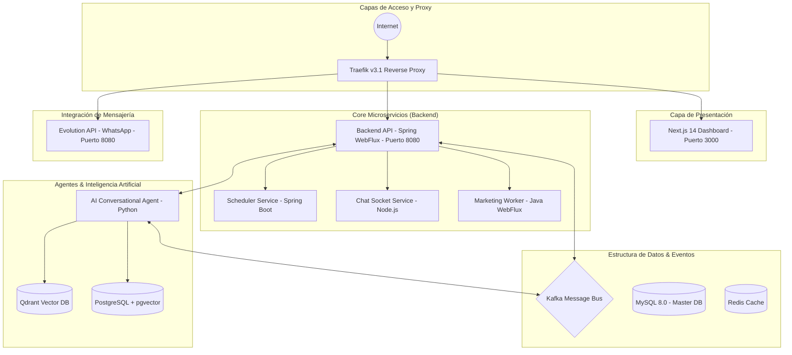
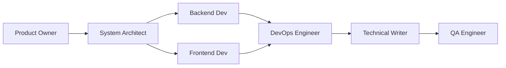

# 📋 Especificación Técnica Máster (spec.md) - CloudFly AI

Este documento es la **Única Fuente de Verdad (SSOT - Single Source of Truth)** para el desarrollo de software dentro del ecosistema **CloudFly**. Todos los agentes de IA de Scrum y desarrolladores humanos deben adherirse estrictamente y cumplir al 100% con los requerimientos, estándares y contratos descritos aquí.

---

## 1. Directrices de Desarrollo Basado en Especificaciones (SDD)

*   **Sin Características Inventadas**: Queda estrictamente prohibido añadir endpoints, variables, campos de base de datos o lógicas secundarias que no estén explícitamente aprobados en este documento.
*   **TDD Estricto**: Todo código fuente implementado debe contar con su correspondiente archivo de pruebas automatizadas (ej: `test_*.py`, `*.test.js` o `.spec.js`) que valide la lógica de negocio antes de proceder a la fase de integración o despliegue.
*   **Git e Integración Continua**: Cada tarea completada con éxito y verificada mediante pruebas automatizadas debe guardarse usando la herramienta de control de versiones Git antes de proceder al cierre del ticket.

---

## 2. Mapa de Arquitectura General de CloudFly

El sistema se compone de una arquitectura distribuida y reactiva:



### Tecnologías Clave y Puertos
*   **Dashboard**: Next.js 14 / TypeScript (`dashboard.cloudfly.com.co` / Puerto 3000 en el directorio activo `frontend_new`)
*   **Backend API**: Spring Boot 3.4 / WebFlux (`api.cloudfly.com.co` / Puerto 8080)
*   **Base de Datos Principal**: MySQL 8.0 (Base de datos: `cloud_master`)
*   **Evolution API (WhatsApp)**: Motor de comunicación corporativa (`eapi.cloudfly.com.co` / Puerto 8080 interno)
*   **Base de Datos de Evolution API**: PostgreSQL
*   **Motor de Búsqueda Semántica**: Qdrant (`qdrant:6333`) y PostgreSQL (pgvector)
*   **Caché**: Redis (`redis_server:6379`)
*   **Mensajería Asíncrona**: Apache Kafka (`kafka:9092`)

---

## 3. Aislamiento Multi-Tenant y Multi-Company

CloudFly opera bajo un modelo de aislamiento riguroso:
1.  **Tenant (Cliente Raíz)**: Identificado por `tenant_id`. Todo registro comercial (productos, contactos, campañas, órdenes) pertenece obligatoriamente a un Tenant.
2.  **Company (Compañía/Sede)**: Identificado por `company_id`. Representa sucursales lógicas dentro de un Tenant.
*   **Regla de Oro**: Ninguna consulta o inserción puede omitir el filtro por `tenant_id`. Si `company_id` está presente, debe ser filtrado; si es nulo, el usuario con rol jerárquico superior (Admin/Manager) puede ver los datos consolidados del Tenant.

---

## 4. Estructuras de Datos Relevantes (MySQL)

### Tabla de Productos (`productos`)
Representa el inventario del ERP.
*   `id` (BIGINT, PK, Auto Increment)
*   `tenant_id` (BIGINT, FK a `clientes.id`)
*   `company_id` (BIGINT, FK a `companies.id`, opcional)
*   `product_name` (VARCHAR)
*   `product_type` (VARCHAR, ej: 'PRODUCT')
*   `description` (TEXT)
*   `price` (DECIMAL)
*   `inventory_qty` (INT)
*   `manage_stock` (TINYINT/BOOLEAN)
*   `image_url` (VARCHAR, URL completa de la imagen del producto)
*   `status` (VARCHAR, opcional, indica estado activo/inactivo)

### Tabla de Campañas (`campaigns`)
Guarda la configuración y las métricas de las campañas de mercadeo operacional.
*   `id` (BIGINT, PK, Auto Increment)
*   `tenant_id` (BIGINT, FK a `clientes.id`)
*   `company_id` (BIGINT, FK a `companies.id`)
*   `name` (VARCHAR)
*   `description` (TEXT)
*   `status` (ENUM: 'DRAFT', 'SCHEDULED', 'RUNNING', 'PAUSED', 'COMPLETED', 'CANCELLED', 'FAILED')
*   `channel_id` (BIGINT, FK a `channels.id`)
*   `sending_list_id` (BIGINT, FK a `sending_lists.id`, opcional)
*   `pipeline_id` (BIGINT, FK a `pipelines.id`, opcional)
*   `message` (TEXT, plantilla del mensaje de la campaña)
*   `media_url` (VARCHAR, URL del archivo adjunto)
*   `media_type` (ENUM: 'IMAGE', 'VIDEO', 'AUDIO', 'DOCUMENT')
*   `media_caption` (VARCHAR)
*   `product_id` (BIGINT, FK a `productos.id`, opcional)
*   `total_sent` (INT)
*   `total_delivered` (INT)
*   `total_read` (INT)
*   `total_failed` (INT)

---

## 5. Especificación: Agente de Inteligencia Artificial de Marketing (Microservicio)

Este módulo automatiza la creación y ejecución de campañas promocionales para productos activos de manera autónoma, imitando el comportamiento interactivo del agente conversacional de WhatsApp/Chatwoot.

### Requerimiento Funcional
Crear un microservicio autónomo en Python (ubicado en `c:\apps\cloudfly\marketing-agent` o integrado dentro de `ai-agent`) que:
1.  **Consulte y seleccione un Producto Activo**:
    *   Debe buscar en la base de datos MySQL (tabla `productos`) o mediante la API (`GET /productos/tenant/{tenantId}`) un producto del tenant asignado.
    *   **Criterio de Selección de Producto**: Debe estar activo, tener stock disponible (`inventory_qty > 0`), tener precio configurado (`price > 0`), poseer una descripción detallada (`description` no nulo/vacío) y contar con una imagen del producto (`image_url` no nulo/vacío).
2.  **Redacte Contenido Creativo y Persuasivo usando IA**:
    *   Consumirá el servicio de LLM (usando las credenciales de OpenAI o OpenRouter del sistema) para procesar la información del producto (nombre, descripción, precio, marca).
    *   Generará un mensaje publicitario optimizado en formato WhatsApp Markdown, incluyendo emojis, llamada a la acción clara (CTA) y un diseño de copy persuasivo.
3.  **Construya la Campaña en la Base de Datos**:
    *   Creará un registro en la tabla `campaigns` con los siguientes valores mapeados:
        *   `name`: `"Campaña Promocional IA - [Nombre del Producto]"`
        *   `description`: `"Campaña automatizada generada por el Agente de Marketing IA para el producto: [Nombre del Producto]"`
        *   `status`: `"DRAFT"` (Borrador inicial)
        *   `message`: El texto publicitario optimizado generado por la IA.
        *   `media_url`: El `image_url` del producto seleccionado.
        *   `media_type`: `"IMAGE"`
        *   `media_caption`: `"¡Oferta especial de CloudFly! Adquiere [Nombre del Producto] por solo $[Precio]"`
        *   `product_id`: ID del producto seleccionado.
        *   `channel_id`: El canal activo de WhatsApp asignado al Tenant.
        *   `sending_list_id`: La lista de contactos seleccionada para el envío.
4.  **Ejecute la Campaña**:
    *   Cambiará el estado de la campaña a `"RUNNING"`.
    *   Realizará la distribución de mensajes a la lista de contactos utilizando el servicio `marketing-worker` (a través de Kafka o llamado directo a la API de mensajería) o implementará el motor de distribución interna.
    *   **Cumplimiento Anti-Spam Riguroso**:
        *   Intervalo aleatorio de **3 a 12 segundos** por cada mensaje individual.
        *   Pausa extendida de **30 a 45 segundos** por cada lote (**batch size**) de **20 mensajes** enviados consecutivamente.
        *   Simulación de presencia de escritura en WhatsApp (`presence` = `composing` durante 1.5 a 3.5 segundos antes de disparar el mensaje real) a través de la Evolution API.

### Contrato de APIs y Servicios Involucrados

#### Búsqueda de Productos Activos (REST API)
*   **Endpoint**: `GET /productos/tenant/{tenantId}`
*   **Respuesta Exitosa (JSON)**:
    ```json
    [
      {
        "id": 45,
        "tenantId": 1,
        "productName": "Camiseta Deportiva Ultralight",
        "productType": "PRODUCT",
        "description": "Camiseta deportiva transpirable ideal para entrenamientos de alto rendimiento.",
        "price": 49900.00,
        "inventoryQty": 150,
        "imageUrl": "https://img.cloudfly.com.co/products/camiseta-ultralight.jpg",
        "brand": "ActiveFit",
        "model": "2026-X"
      }
    ]
    ```

#### Creación de Campaña (Base de Datos / Backend API)
*   La inserción debe registrarse en la tabla `campaigns` respetando la integridad referencial y las columnas multi-tenant obligatorias.
*   Alternativamente, si el backend expone un endpoint REST para campañas (ej: `POST /campaigns`), el agente de marketing puede consumirlo.

---

## 6. Estructura y Roles del Equipo de Scrum de IA (SDD)

El equipo de ingenieros y especialistas de IA está compuesto por 8 roles complementarios y secuenciales que garantizan la máxima calidad en los entregables:



### 1. Product Owner
*   **Rol**: Orquestador del Backlog y Criterios de Aceptación.
*   **Misión**: Descomponer la petición en tareas de Jira extremadamente detalladas en el proyecto `CLOUD` usando prefijos indentados e integridad ágil.

### 2. System Architect and Tech Researcher
*   **Rol**: Investigador y Diseñador Técnico.
*   **Misión**: Diseñar y diagramar la arquitectura y diseño técnico de las soluciones del sprint.
*   **Directriz Crítica**: **DEBE iniciar toda investigación técnica analizando el archivo máster de infraestructura `docker-compose-full-vps.yml`** en la raíz para comprender las dependencias, puertos, volúmenes, redes y variables de entorno reales de la aplicación, antes de buscar tecnologías externas o redactar planes de arquitectura.

### 3. Senior Backend/Systems Developer (`software_developer`)
*   **Rol**: Programador de Lógica, Bases de Datos y Configuraciones.
*   **Misión**: Desarrollar la API REST en Spring Boot, consultas SQL en MySQL, y configuraciones reactivas en Kafka o FreeSWITCH.

### 4. Senior Frontend Developer (`frontend_developer`)
*   **Rol**: Programador de Interfaces de Usuario (UI/UX).
*   **Misión**: Construir interfaces de usuario premium, realistas y responsivas en **Next.js 14 (App Router)**, React, TypeScript y Tailwind CSS estrictamente en el directorio de trabajo activo **`C:\apps\cloudfly\frontend_new`**.

### 5. DevOps & Cloud Engineer
*   **Rol**: Automatización de Despliegue y Contenedores.
*   **Misión**: Escribir Dockerfiles, configurar `docker-compose.yml` y levantar el entorno local mediante comandos de consola verificando que los microservicios estén saludables.

### 6. Technical Writer and Diagram Specialist (`technical_writer`)
*   **Rol**: Redactor Técnico y Modelador de Diagramas.
*   **Misión**: Documentar los requerimientos de la aplicación e interfaces en **formato Markdown (.md)**.
    *   **Directorio de Entrega Obligatorio**: Todos los documentos creados se guardarán strictly en la carpeta **`C:\apps\cloudfly\docs`**.
    *   **Prefijo Distintivo**: Los archivos creados obligatoriamente iniciarán con el prefijo **`AGENTE_DEV_`** (ej. `AGENTE_DEV_arquitectura.md`).
    *   **Diagramas Mermaid**: Los diagramas visuales generados mediante **Mermaid.js** se incrustarán directamente dentro del propio archivo Markdown usando bloques de código cercados (```mermaid). No se permiten archivos sueltos de imagen.

### 7. Quality Assurance (QA) Engineer
*   **Rol**: Validador de Calidad y Creador de Pruebas.
*   **Misión**: Garantizar la calidad del software a lo largo de **todo el ecosistema del proyecto** mediante pruebas unitarias, de integración y E2E.
    *   **Mandato Completo**: No está limitado a un solo módulo. Debe validar la API Backend (Spring Boot WebFlux), la consistencia e integridad de datos en MySQL, la mensajería y flujos reactivos (Evolution API, FreeSWITCH, Kafka) y el Frontend UI.
    *   **Pruebas del Frontend**: Si la tarea involucra la interfaz web, el QA **debe escribir pruebas de integración/E2E automatizadas (Playwright o Cypress)**.
    *   **Directorio de Pruebas**: Guardará los scripts de prueba en **`C:\apps\cloudfly\frontend_new\tests\`** o `frontend_new/e2e/`, con extensión `.spec.js`/`.spec.ts`, comenzando con el prefijo **`AGENTE_DEV_`**.
    *   **Ejecución**: Correrá los comandos locales (ej: `cd frontend_new && npx playwright test` o scripts de integración en Python/Node para backend) y solo dará el visto bueno de Jira a `Finalizada` si todas las pruebas pasan con 0 fallos.

### 8. Scrum Master / Agile Manager
*   **Rol**: Facilitador y Monitor del Tablero de Control.
*   **Misión**: Conducir el sprint y reportar estadísticas de control de tareas en Jira (Finalizadas vs Pendientes) directamente en la consola de logs.

---

## 7. Plan de Pruebas Automatizadas (TDD)

Cada componente o script de este ecosistema debe validarse de forma local:
1.  **Prueba de Selección**: Assert que el agente de marketing solo selecciona productos activos con stock, precio, descripción e imagen.
2.  **Prueba de Generación de Copy**: Assert que la llamada a la IA devuelve un texto comercial formateado que contiene el precio y el nombre del producto.
3.  **Prueba de Inserción en Campañas**: Verificar mediante mock de base de datos que se registra la campaña correctamente con su respectivo `media_url` y `media_type`.
4.  **Prueba de Retardo Anti-Spam**: Confirmar que los temporizadores de envío cumplen con los retardos mínimos de seguridad y presencia de escritura para proteger los números de WhatsApp en Evolution API.
5.  **Pruebas E2E del Frontend**: Asegurar que las pruebas del frontend (`AGENTE_DEV_*.spec.js`) en `frontend_new` corren sin errores de validación de elementos UI.

---

## 8. Especificaciones de Git-Flow y Despliegue DevOps

El ciclo de desarrollo en Git, compilación de contenedores y despliegue en producción debe cumplir estrictamente con las siguientes directrices técnicas:

### 1. Estrategia de Ramas (Git Flow)
*   **Entorno Local (Desarrollo)**: Todas las tareas que sean completadas en el entorno de desarrollo local relacionadas con el microservicio de marketing y la integración de campañas deben registrarse, confirmarse (commit) y subirse (push) estrictamente en una rama llamada **`marketing_ai_team`**.
*   **Entorno VPS (Producción/Staging)**: El servidor VPS ejecuta e integra todo el ecosistema de microservicios de CloudFly utilizando únicamente la rama llamada **`desarrollo`**.

### 2. Flujo de Despliegue y Autenticación en el VPS
*   El despliegue en el VPS se realiza mediante conexión segura autenticada utilizando **Git SSH Keys** (llaves SSH previamente autorizadas en el servidor).
*   La actualización y sincronización de código en el VPS se realiza ejecutando el comando **`git pull`** sobre la rama activa `desarrollo`.

### 3. Orquestación y Construcción del Frontend (`frontend_new`)
*   **Compilación Local Obligatoria**: Debido al alto consumo de recursos (CPU, RAM) implicado en la compilación de la aplicación React/Next.js de `frontend_new`, **la construcción de esta imagen Docker NO se realiza dentro del servidor VPS**.
*   **Procedimiento**:
    1.  La imagen Docker de `frontend_new` se construye y compila localmente en la máquina de desarrollo (`docker build` local con sus argumentos).
    2.  Se exporta la imagen a un archivo `.tar` utilizando el comando `docker save`.
    3.  Se sube el archivo `.tar` al servidor VPS a través de SCP.
    4.  El servidor VPS carga la imagen localmente utilizando el comando `docker load`.
    5.  Finalmente, se recrea y reinicia el contenedor correspondiente (`docker compose up -d`) asegurando que apunte a la imagen cargada, evitando así picos de carga en producción.

---
> [!NOTE]
> Este documento ha sido estructurado y redactado para servir de base estricta de desarrollo de software. Si detecta cualquier inconsistencia en la base de datos o API durante el proceso de Scrum, repórtelo inmediatamente.
